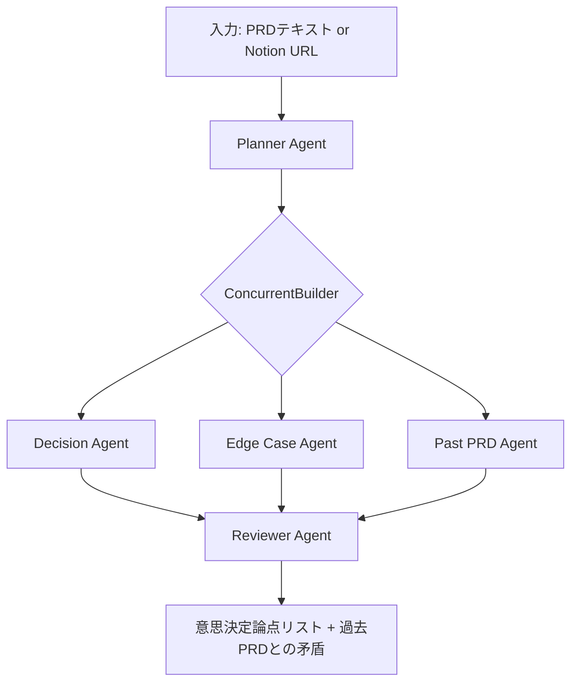

# 仕様書に埋もれた「決まっていない意思決定」を、マルチエージェントで炙り出す

— Microsoft Agent Framework で組んだ Specify の話

## この記事で伝えたいこと

仕様書を書いた。レビューも通った。実装が始まった。

しかし、実装中にこんな質問が飛んでくる。

> データが0件のときはどう表示しますか?  
> 権限のないユーザーが画面を開いたら?  
> ボタンを連打したらどうなりますか?

仕様書には書かれていない。  
書いたつもりだったが、実は決まっていなかった。

この記事では、こうした **「仕様書に埋もれた、決まっていない意思決定」** をマルチエージェントで炙り出すプロダクト **Specify** を作った話を書く。

Specify は、Microsoft Agent Framework 1.0 と Azure OpenAI を使い、仕様書を複数の観点から分析するツールである。

デモ用に用意した仕様書では、以下の結果が得られた。

| 項目 | 結果 |
|---|---:|
| 抽出された意思決定論点 | 10件 |
| 過去仕様書との矛盾 | 2件 |
| うち、仕様書に明記されていなかった論点 | 7〜8件 |


*結果画面: 抽出された意思決定論点と過去仕様書との矛盾が 1 画面にまとまる*

これは実プロダクト導入後の効果測定ではなく、ハッカソン提出用デモにおける検証結果である。

特に重要なのは、**過去仕様書で決まっていたルールをもとに、新しい仕様書の漏れを補完できるようにしたこと** である。

単に今の仕様書を読むだけではなく、過去の意思決定を参照しながら、未決定の論点を発見する。  
これが Specify の中核である。

---

## 開発現場で起きていること

仕様書レビューを通過しても、実装中に仕様確認が止まらないことがある。

### ケース1: 「データが空のとき」が決まっていない

ユーザー一覧画面の仕様書を書く。  
検索機能もある。ソートもできる。レビューでも特に指摘はなかった。

しかし、実装やQAの段階でこう聞かれる。

> 検索結果が0件のとき、どう表示しますか?  
> 初回ログイン直後でデータがまだ1件もないときは?  
> フィルタをかけた結果の0件と、そもそも0件の状態は分けますか?

仕様書には「ユーザー一覧を表示する」としか書かれていない。

空状態の体験は、誰も決めていなかった。

### ケース2: 権限による振る舞いが曖昧

設定画面に「ユーザー追加」ボタンを置く仕様を書く。  
仕様書には「管理者だけがユーザーを追加できる」と書いた。

しかし、実装中にこう聞かれる。

> 一般ユーザーがこの画面を開いたとき、ボタンは非表示ですか? disabled 表示ですか?  
> 画面を開いている途中で権限が外された場合はどうしますか?  
> ボタンを押した瞬間に権限が変わっていた場合、サーバー側でも弾きますか?

「管理者だけが追加できる」という1文だけでは、UIの見せ方、状態遷移、サーバー側の防御までは決まらない。

### ケース3: 連続クリック・二重送信が抜ける

フォーム送信ボタンの仕様を書く。  
送信後の遷移も、エラー時の表示も書いた。

しかし、リリース後に問い合わせが来る。

> 同じ申請が2件登録されています。

原因は、ボタンの連続クリックだった。  
リクエストが2回飛び、サーバー側でも冪等性を担保していなかった。

仕様書には「フォームを送信する」としか書かれていなかった。  
二重送信防止は、誰も明示的に決めていなかった。

---

## 課題を整理する

この問題を、事実・解釈・仮説・手段に分けると以下になる。

| 区分 | 内容 |
|---|---|
| 事実 | 仕様書レビューを通過しても、実装中に仕様確認が発生する |
| 解釈 | 仕様書には「書かれていること」はあるが、「決まっていないこと」が残っている |
| 仮説 | 複数の観点から仕様書を読む仕組みがあれば、レビュー前に意思決定漏れを発見できる |
| 手段 | 複数のエージェントに役割を分け、仕様書を並列に分析する |

仕様書のレビューでは、書かれていることの確認はしやすい。  
一方で、**書かれていないことを見つけるのは難しい**。

空状態、権限、異常系、過去仕様との整合性。  
これらは、単一の視点では見落としやすい。

そこで Specify では、仕様書を複数のエージェントに分担して読ませる構成にした。

---

## Specify とは

Specify は、書き終えた仕様書から「決まっていない意思決定」を抽出するマルチエージェントツールである。


*入力画面: 仕様書テキストを貼るか、デモ用 PRD から選んで分析を開始する*

想定している使い方は、仕様書レビューの前段である。

```text
仕様書を書く
→ Specify に通す
→ 意思決定論点を確認する
→ 仕様書に追記する
→ レビューに進む
→ 実装中の仕様確認を減らす
````

Specify は、レビューの代替ではない。
レビュアーが「書かれていないこと」を探す負担を減らし、本来見るべきプロダクト価値や方針の妥当性に集中できるようにするためのものだ。

入力は、仕様書テキストまたは Notion ページ URL。
出力は、優先度付きの意思決定論点リストと、過去仕様書との矛盾である。

各論点には、選択肢も付ける。

たとえば、空状態の論点なら以下のような出力になる。

```json
{
  "title": "検索結果が0件のときの表示をどうするか",
  "priority": "must",
  "category": "empty_state",
  "options": [
    "専用の空状態メッセージを表示する",
    "検索条件の変更を促す導線を表示する",
    "初回0件と検索結果0件で表示を分ける"
  ],
  "rationale": "実装前に表示方針を決めないと、UI実装とQAで手戻りが発生するため"
}
```

単に「ここが足りない」と指摘するだけでなく、議論のたたき台になる形で返す。


*論点カード 1 枚: 優先度・カテゴリ・選択肢・メモが 1 つの単位に収まる*

この出力形式は、単なるチェックリストではなく、意思決定の記録にも転用しやすい。

### ADR(Architecture Decision Record)との親和性

Specify が出力する各意思決定論点は、title、options、rationale という構造を持っている。

これは ADR(Architecture Decision Record) とも相性がよい。
ADR は、アーキテクチャや設計上の意思決定を、選択肢と理由とともに記録するための手法である。

ADR を運用しているチームでは、Specify の出力をそのまま ADR の下書きとして使える。
意思決定漏れを発見すると同時に、組織のドキュメント文化に乗せやすい形で記録できる。

つまり Specify は、新しい意思決定ドキュメントを作るだけでなく、**既存のナレッジ管理プラクティスに自然に接続できる** ように設計している。

---

## なぜマルチエージェントなのか

最初は、単一の LLM に PRD を渡して、意思決定論点を JSON で返すだけの構成を試した。

※ LLM は Large Language Model の略で、ChatGPT のような大規模言語モデルを指す。
※ PRD は Product Requirements Document の略で、プロダクト要求仕様書のこと。

単一 LLM でも、ある程度は動いた。
しかし、いくつかの限界があった。

### 限界1: 観点が偏る

UI/UX の論点は拾えるが、異常系の指摘が弱い。
プロンプトを変えてエッジケースを強めると、今度はUIの論点が弱くなる。

1回の LLM 呼び出しで、すべての観点を安定して見るのは難しかった。

### 限界2: 過去の意思決定を知らない

LLM は、目の前の仕様書は読める。
しかし、過去の仕様書で決まっていたルールは知らない。

たとえば、過去仕様書で「ユーザー追加・削除は必ず操作ログに残す」と決まっていたとする。
新しい仕様書に操作ログの記述がない場合、それは重要な漏れである。

しかし、単一 LLM に新しい仕様書だけを渡しても、この矛盾は検出できない。

### 限界3: 抽出と優先度判断が混ざる

単一 LLM では、論点を網羅的に出すことと、優先度を判断することを同時に行う。

その結果、網羅性を重視すると優先度が甘くなり、優先度を重視すると論点が減ることがあった。

そこで、Specify では役割を分けた。

---

## 全体アーキテクチャ

Specify は、5つのエージェントで構成している。




*分析中画面: Planner → 3 並列 Agent → Reviewer がリアルタイムで進行する様子を可視化*

各エージェントの役割は以下の通り。

| エージェント          | 役割                             |
| --------------- | ------------------------------ |
| Planner Agent   | 仕様書を読み、後続エージェントが注目すべき観点を整理する   |
| Decision Agent  | UI/UXやドメイン上の意思決定漏れを抽出する        |
| Edge Case Agent | 連続クリック、セッション切れ、二重送信などの異常系を抽出する |
| Past PRD Agent  | 過去仕様書と新仕様書の矛盾を検出する             |
| Reviewer Agent  | 各出力を統合し、重複排除、優先度調整、論点補完を行う     |

Microsoft Agent Framework の `ConcurrentBuilder` を使い、Decision Agent、Edge Case Agent、Past PRD Agent を並列に実行している。

※ ConcurrentBuilder は、Microsoft Agent Framework に用意されている、複数エージェントを並列実行するための仕組みである。

---

## 実装で一番工夫したところ

一番試行錯誤したのは、Past PRD Agent の出力を Reviewer Agent にどう合流させるかだった。

当初は、次のような動きを想定していた。

1. Decision Agent が「監査ログ要件」を論点として出す
2. Past PRD Agent が「過去仕様では操作ログ必須だった」と矛盾を検出する
3. Reviewer Agent が両者を統合し、該当論点の優先度を `must` に上げる

つまり、2つのエージェントが別方向から同じ問題を指摘し、Reviewer Agent で合流する想定だった。

しかし、実際に動かすと問題が起きた。

Decision Agent が「監査ログ要件」を出さないことがあった。
一方で、Past PRD Agent は過去仕様との矛盾を正しく検出している。

つまり、矛盾は見つかっている。
しかし、それに対応する decision が存在しないため、Reviewer Agent が格上げできない。

そこで設計を変えた。

Reviewer Agent に、以下のルールを持たせた。

```text
過去仕様との矛盾に対応する decision が存在する場合:
- その decision の priority を must に格上げする
- rationale に、過去仕様との矛盾による格上げであることを追記する

過去仕様との矛盾に対応する decision が存在しない場合:
- その矛盾を新規 decision として追加する
```

この変更により、Past PRD Agent が検出した矛盾が、単なる参考情報ではなく、新しい意思決定論点として補完されるようになった。

実装上は、Reviewer Agent に Decision Agent / Edge Case Agent の出力だけでなく、Past PRD Agent の矛盾リストも渡すようにした。

```python
reviewer_input = (
    "# Decision Agent output\n"
    f"{json.dumps(decision_out, ensure_ascii=False, indent=2)}\n\n"
    "# Edge Case Agent output\n"
    f"{json.dumps(edge_case_out, ensure_ascii=False, indent=2)}\n\n"
    "# Past PRD Agent contradictions\n"
    f"{json.dumps(past_prd_out, ensure_ascii=False, indent=2)}\n"
)
```

これにより、Reviewer Agent は既存の decision を統合するだけでなく、過去仕様との矛盾から新しい decision を生成できるようになった。

これは Specify の中核である。

つまり、Specify は **「今の仕様書だけを読むツール」ではない**。
過去の意思決定を参照し、新しい仕様書に足りない論点を補完する。

この構造によって、属人化していた組織知を、仕様書レビューの中に自然に戻せるようになった。

### 設計後に気づいた脆さと、構造化フィールドへの差し替え

最初の実装では、Reviewer Agent が `rationale` の末尾に「(Past PRD ... との矛盾により格上げ)」というマーカー文字列を埋め込み、フロントエンドはその文字列を含むかどうかで「過去仕様書由来の論点」を判別していた。

動いてはいたが、これは Reviewer のプロンプト文言を磨いた瞬間に **silently 壊れる** 構造だった。
たとえば「格上げ」を「昇格」に書き換えただけで、画面側のバッジ表示と専用フィルターが、エラーひとつ出さずに無効化される。

そこで decision のスキーマに `source: "past_prd" | "agent"` という enum を追加し、Reviewer Agent にこのフィールド自体を出力させる構造に切り替えた。
フロントエンドは `decision.source === "past_prd"` を参照するだけになり、プロンプトの言い回しから完全に切り離せる。
さらに、LLM が `source` をセットし忘れる事故に備え、バックエンド側の post-processing でマーカー文字列にもマッチさせて補完する二段構えにしている。

LLM の出力に依存する判別ロジックを書くときは、自然文ではなく、スキーマ上の構造化フィールドで受け取る方が安全だ、というのが今回の学びだった。


*過去仕様書由来の論点はバッジと左ボーダーで強調し、上部のボタンで該当論点だけに絞り込める*

---

## Microsoft Agent Framework 1.0 での実装メモ

実装には Microsoft Agent Framework 1.0 を使った。

ハマった点はいくつかある。

### パッケージが分かれている

Agent Framework は単一パッケージではなく、コアとプロバイダーが分かれている。

最低限、以下が必要だった。

```toml
dependencies = [
    "agent-framework-core>=1.2.2",
    "agent-framework-openai>=1.2.2",
    "agent-framework-orchestrations>=1.0.0b0",
]
```

`core` / `openai` / `orchestrations` の 3 つすべてが必要だった。
特に `ConcurrentBuilder` は `agent-framework-orchestrations` に入っており、これを入れ忘れると import エラーになる。
`orchestrations` は 2026 年 5 月時点でまだ beta（1.0.0b0 系）のため、バージョン指定は beta 含めて固定している。

### `model_id` ではなく `model`

OpenAI SDK の感覚で `model_id` を渡したくなるが、Agent Framework では `model` が正しい。

この違いに気づくまで少しハマった。

### ConcurrentBuilder の with_aggregator

並列実行の結果を統合するには、`ConcurrentBuilder` に `with_aggregator` を渡す。

Specify では、Reviewer Agent を aggregator として渡している。

```python
from agent_framework import ConcurrentBuilder

workflow = (
    ConcurrentBuilder()
    .add(decision_agent)
    .add(edge_case_agent)
    .add(past_prd_agent)
    .with_aggregator(reviewer_aggregator)
    .build()
)
```

また、Agent Framework 1.0 は新しいため、万一 `ConcurrentBuilder` 側で問題が起きた場合に備え、`asyncio.gather` によるフォールバック経路も用意した。

---

## プロンプト設計の学び

最初は、役割ベースのプロンプトを書いていた。

```text
あなたはプロダクトマネジメントの専門家です。
仕様書から意思決定論点を抽出してください。
```

しかし、この形式では出力が安定しなかった。

「専門家」という役割定義に頼ると、LLM の判断が曖昧になり、同じ PRD でも結果が揺れやすい。

そこで、機能ベースのプロンプトに変えた。

```md
# 機能
仕様書テキストから、明示されていない意思決定論点を抽出する

# 出力
JSON配列。各要素は以下のスキーマに従う:
- title
- priority
- category
- options
- rationale

# 優先度の判断基準
- must: 実装前に決めないと手戻りや事故につながる
- should: 早めに決めると品質が上がる
- nice: 後からでも調整できる
```

役割ではなく、機能、出力形式、判断基準を明示した方が、出力は安定した。

マルチエージェント構成では、各エージェントの責務が曖昧だと、出力も曖昧になる。
そのため、プロンプトでは「誰として振る舞うか」よりも、「何を入力に、何を出力するか」を明確にした。

---

## やらないこと

Specify は、仕様書の正解を自動で決めるツールではない。

あくまで、決めるべき論点を発見し、選択肢を提示するためのものである。
最終的な意思決定は、PM、デザイナー、エンジニアなど、プロダクトに関わる人が行う。

また、すべての論点を完全に網羅できるわけではない。
LLM を使う以上、出力には揺らぎがある。

そのため、Specify の結果は「レビュー前の補助線」として扱う。
人間のレビューを置き換えるのではなく、人間がレビューすべき論点を見つけやすくするためのものだ。

---

## 想定される業務インパクト

Specify の価値は、仕様書レビュー後に発生する確認・手戻りを減らすことにある。

中規模 B2B SaaS チームを想定すると、以下のように試算できる。

| 項目                    |            値 |
| --------------------- | -----------: |
| 仕様書1本あたり、実装中に発生する仕様確認 |          週5件 |
| 1件あたりのPM・デザイナー判断時間    |         約30分 |
| 月間消費工数                |  約10時間 / 仕様書 |
| Specifyで事前に解消できる割合    |       50〜70% |
| 削減見込み                 | 月5〜7時間 / 仕様書 |

仮に開発・デザイン・PMの確認コストを 4,000円 / 時間 と置くと、仕様書1本あたりの削減効果は以下になる。

```text
20,000〜28,000円 / 月
= 5〜7時間 × 4,000円
```

月に5本の仕様書を扱うチームなら、以下の削減が見込める。

```text
100,000〜140,000円 / 月
= 20,000〜28,000円 × 5本
```

もちろん、これはデモ仕様書をもとにした仮説試算であり、実際の効果は組織や仕様書の性質によって変わる。

ただ、仕様確認による手戻り、Slackでの確認、再合意、デザイン修正、実装修正の時間を考えると、レビュー前に論点を洗い出す価値は十分にある。

---

## コストと運用

Specify は、1本の仕様書を分析するために5つのエージェントを呼び出す。

デモ仕様書を基準にすると、トークン消費はおおよそ以下になる。

| エージェント          |      入力 |     出力 |
| --------------- | ------: | -----: |
| Planner         |  約2,000 |   約300 |
| Decision Agent  |  約2,500 | 約2,000 |
| Edge Case Agent |  約2,500 | 約1,500 |
| Past PRD Agent  |  約4,000 |   約800 |
| Reviewer        |  約4,500 | 約2,500 |
| 合計              | 約15,500 | 約7,100 |

GPT-4o-mini 前提では、仕様書1本あたりの LLM コストは約1円程度に収まる。

実行基盤は Azure Container Apps を使った。
`min-replicas=0` にすることで、使っていない時間の固定費を抑えている。

Specify はリアルタイム性が強く求められるツールではない。
仕様書を書き終えたあとに分析する用途なので、多少のコールドスタートは許容できる。

つまり、Specify は「使うときだけコストがかかる」構成にできる。

---

## 導入シーン

Specify は、仕様書を書いて開発する組織であれば使える。

### 中規模の B2B SaaS チーム

PM、デザイナー、エンジニアが少人数で動いていて、レビュー体制を厚くする余裕がない場合でも、仕様書を書いた人が Specify に通すだけで、意思決定論点を事前に洗い出せる。

### B2C サービスの新機能開発

B2C では、ユーザー状態が多様になる。
初回ユーザー、リピーター、ログアウト状態、ネットワーク不安定、複数デバイス利用など、仕様書で考慮すべき状態が多い。

こうしたケースでは、Edge Case Agent の指摘が効きやすい。

### SIer・SE 文化のチーム

基本設計書(ユーザー視点)と詳細設計書(開発者視点)を分けて作成する文化のチームでも、それぞれを Specify に通すことで、各段階の意思決定漏れを発見できる。

特に、テスト作成段階で発覚しがちな観点(パフォーマンス、セキュリティなど)を、設計レビュー前に潰せる可能性がある。

ADR をすでに運用しているチームなら、Specify の出力をそのまま ADR の下書きとして使えるため、既存のドキュメント文化に組み込みやすい。

### Notion 連携で既存フローに乗せる

Notion 連携は実装済みである。

新しい仕様書側は、Notion URL を入力すると対象ページの本文を取得して PRD テキストとして各エージェントに渡す。
過去仕様書側は、事前に指定した Notion データベースから関連ページを取得し、Past PRD Agent の入力としてそのまま流している。

仕様書を Notion で管理している組織では、新しいツールを学ぶ必要も、既存資産を移行する必要もない。

「Specify を導入する」=「Notion の URL を 1 つ貼る」くらいの低い障壁で始められる。

---

## 今後の展望

今後の拡張方向はいくつかある。

### Past PRD のデータソース拡充

現在は Notion 連携を実装済み。
今後は Confluence、Google Docs、GitHub Wiki などにも対応できれば、より多くの組織で使いやすくなる。

### 観点別エージェントの追加

現在の Decision Agent / Edge Case Agent は UI/UX と異常系を主にカバーしている。

これを拡張して、パフォーマンス観点(レスポンスタイム、データ量、同時アクセスなど)、セキュリティ観点(認可、入力検証、データ保護など)を専門に扱うエージェントを追加したい。

テスト段階で発覚しがちなこれらの観点を、設計フェーズで先回りして拾えるようになる。

SIer や SE 文化のチームに対して、特に効果が大きくなる見込み。

### ドメイン適応性の向上

医療、金融、教育など、ドメイン固有の論点を追加できるカスタムプロンプトの仕組みも入れたい。

たとえば、金融なら監査性や権限管理、医療なら安全性や説明責任、教育なら年齢や保護者同意などが重要になる。

こうした組織ごとの観点を追加できるようにすると、より実運用に近づく。

### プレビュー機能の拡張


*画面プレビュー: 意思決定論点に応じた状態を切り替えて確認できる*

現在のプレビュー機能は、各意思決定論点の選択肢ごとに画面状態を表示する設計。
これを「複数選択肢の同時比較」「遷移シミュレーション」「Figma 連携」の方向に拡張したい。

---

## まとめ

Specify は、仕様書に埋もれた「決まっていない意思決定」を、マルチエージェントで炙り出すプロダクトである。

仕様書レビューを通過しても、実装中に仕様確認が止まらないことがある。
その原因は、仕様書に「書かれていること」ではなく、「書かれていないこと」にある。

書かれていない論点を見つけるには、UI/UX、エッジケース、過去仕様との整合性など、複数の視点が必要になる。
1人のレビュアーや単一 LLM にすべてを任せるのは難しい。

そこで Specify では、5つのエージェントに役割を分けた。

特に、Past PRD Agent と Reviewer Agent による **「過去の意思決定が、新しい仕様書の漏れを補完する」** 仕組みは、このプロダクトの中核である。
属人化していた組織知を、ドキュメント化のループに戻すための装置として設計した。

PRDレビューは通った。
でも実装中に仕様確認が止まらない。

そんな現場の摩擦に対して、Specify がひとつの答えになれば嬉しい。

---

### リンク

* **デモ環境**: [Specify 本番URL]
* **デモ動画**: [3分動画 YouTubeリンク]
* **GitHubリポジトリ**: [GitHubリポジトリURL]
